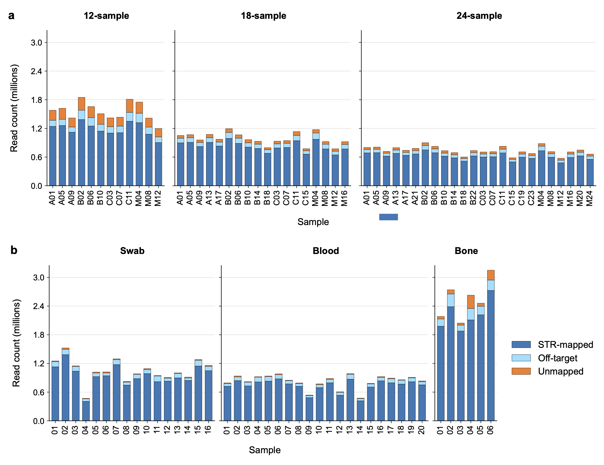
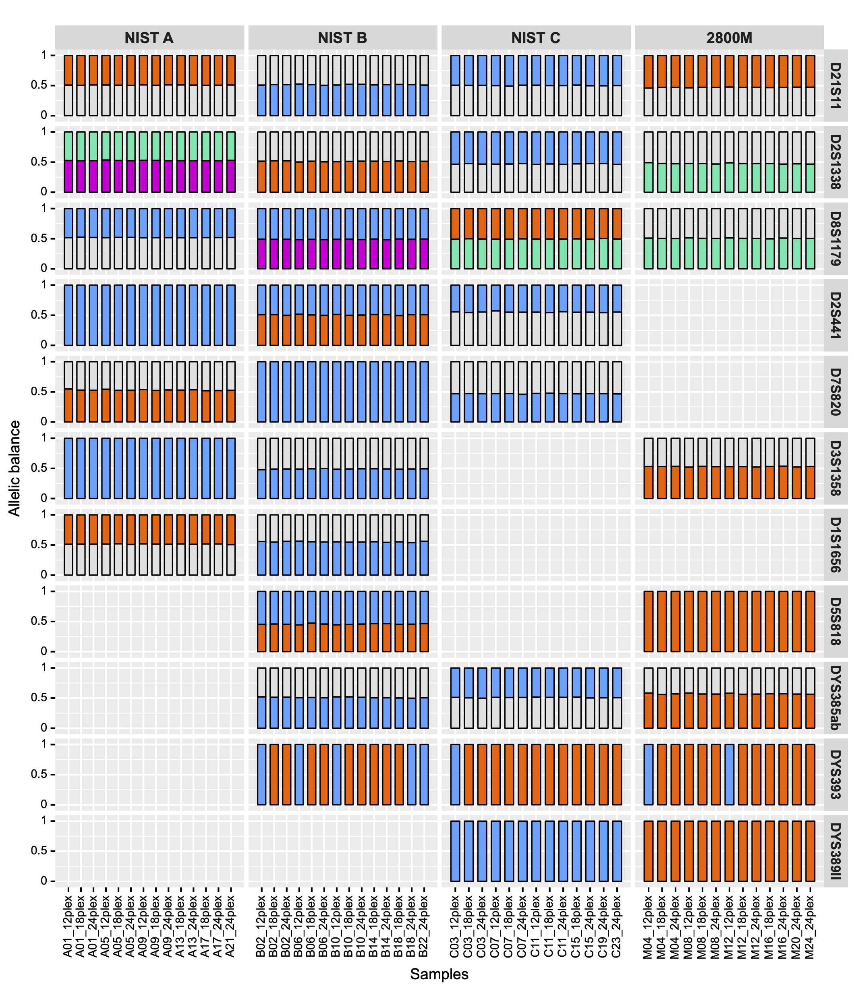
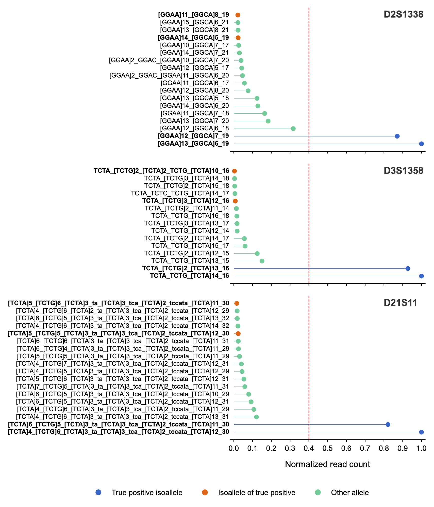

<p align="center">
<strong>STRspy2.0</strong>: Unlocking the Potential of Long Reads for Forensic DNA Profiling.
</p>

# NEWS: We are excited to announce the new release of STRspy, version 2.0.

( https://github.com/unique379r/strspy/tree/STRspy2.0 )

## Whats New in STRspy2.0
### 1. DB_v2: Autosome and ChrY-specific STRs (comprehensive STR database from GenBank records in the STRSeq BioProject (accessions: PRJNA380345 and PRJNA380347))
### 2. New Utility script to generate DB from Genebank and Fasta.
### 3. New Interface of command line options from main scripts
### 4. New Benchmarking results with multiple datasets including Case Samples


## Cite

<p align="justify">
Hall CL, Kesharwani RK, Phillips NR, Planz JV, Sedlazeck FJ, Zascavage RR. Accurate profiling of forensic autosomal STRs using the Oxford Nanopore Technologies MinION device. Forensic Sci Int Genet. 2022 Jan;56:102629. doi: 10.1016/j.fsigen.2021.102629. Epub 2021 Nov 17. PMID: 34837788. https://pubmed.ncbi.nlm.nih.gov/34837788/
</p>

## Latest Publication 

<p align="justify">
Hall, C.L.; Kesharwani, R.K.; McBroom Henson, K.E.; Kapema, B.; Phillips, N.R.; Sedlazeck, F.J.; Zascavage, R.R. STRspy2.0: Unlocking the Potential of Long Reads for Forensic DNA Profiling. Int. J. Mol. Sci. 2026, 27, 1889. https://doi.org/10.3390/ijms27041889
</p>

# STRspy2.0


<p align="justify">
Figure 1. Schematic overview of STRspy2.0 workflow. (a) STRspy2.0 relies on an STR allele database to generate profiles consistent with established length-based forensic nomenclature. Users can use the STRspy2.0 database or build their own from GenBank records. When GenBank records are provided, STRspy2.0 automatically generates database entries using the locus name, reference chromosome, repeat location, repeat sequence, and flanking sequence variants, then adds 500 bp flanks from hg38 to each allele. (b) During data analysis, STRspy2.0 aligns reads to the human reference genome, extracts those overlapping STR loci, and realigns them to the STR allele database. Each allele is ranked by normalized read count to determine the genotype at each locus. 
</p>

## Abstract

<p align="justify">
Forensic human identification relies on length-based differences in short tandem repeats (STRs) across autosomal and Y chromosomes, which require separate reactions and provide limited resolution. While next-generation sequencing offers greater discriminatory power, most platforms are expensive and restricted to traditional lab settings. Nanopore sequencing has the potential to change this with the real-time, portable MinION sequencer. However, forensic-specific tools that generate STR profiles compatible with established length-based databases are lacking. To address this, we developed STRspy2.0, which simultaneously profiles autosomal and Y-STRs using nanopore reads. STRspy2.0 produced accurate profiles for 54 multiplexed control libraries and 41 mock casework samples (blood, swab, bone), achieving overall F1-scores of 100% and 99.75%, respectively. It maintains compatibility with existing forensic databases while providing higher resolution than traditional profiles. Our updated method and comprehensive database, along with the MinION’s small size and price, make sequence-based STR profiling more accessible to forensic laboratories and resource-limited settings..
</p>

## Key Features

1. Input either fastq (raw reads usually from ONT) or bam (pre-aligned reads by user)
2. Reports raw counts of allele and Normalized counts by their maximum value
3. Find the top two significant Alleles (filtering threshold set by the user such as 0.4)
4. Now also detect top one for Y-STR.
4. Detects Small variants such as SNP and Indels
5. Reports mapping summary and STR region of overlaps
6. Stutters analysis for simple motifs of STRs

## Installation

1.1 Install Miniconda

Download Miniconda installer from here: https://docs.conda.io/en/latest/miniconda.html and Install it to your laptop or server.

### Conda under linux environment

```
wget https://repo.anaconda.com/miniconda/Miniconda3-latest-Linux-x86_64.sh

bash Miniconda3-latest-Linux-x86_64.sh

```

Follow the instructions directed by the miniconda script

1.2 Install STRspy 

STRspy v2.0 requires the installation of the following third-party software..

```
gnu parallel >=20210222

samtools >=v1.12

bedtools >=v2.30.0

minimap2 >=v2.18-r1015

xatlas >=v0.3

seqkit >=v2.4.0
```

### Clone the repository

```
git clone --branch STRspy2.0 --single-branch https://github.com/unique379r/strspy.git

cd strspy
```

### Create an environment

```
bash setup/STRspy_2.0.setup.sh

conda activate strspy_env

bash setup/GenerateToolConfig.sh

mv setup/UserToolsConfig.txt config/

conda deactivate
```

## Quickstart

Modify the config files describing your data `config/InputConfig.txt`

## Run STRspy

```
cd strspy

bash ./STRspy_run_v2.0_Args.sh -h

USAGE: bash ./STRspy_run_v2.0_Args.sh config/InputConfig.txt config/ToolsConfig.txt

```

## InputConfig.txt

INPUT_DIR	: A dir must have either fastq (Oxford nanopore genomic reads) or bam (aligned genomic reads such as from PacBio)

INPUT_BAM	: Given inputs are bam or fastq (yes or no)

READ_TYPE	: Sequencing Technology (ont or pb)

STR_FASTA	: A dir contains Fasta files for each STR region of interest [assimung it has flanking regions (+/-) of 500bp]

STR_BED 	: A dir contains Bed files for each STR region of interest [assimung it has flanking regions (+/-) of 500bp]

GENOME_FASTA: Genome fasta (hg19/hg38) must provide in case of fastq input.

REGION_BED	: All STr\R bed has to concatenate into a single bed file to calculate the coverage of it from the alignment sample file.

NORM_CUTOFF	: A normalization threshold is required to select the top two allles of a STR

OUTPUT_DIR : A empty directory to write the results

THREADS    : Number of memory should be used (default = 1)

## ToolsConfig.txt

```

BEDTOOLS 	=	../user/path/bedtools

MINIMAP 	=	../user/path/minimap2

SAMTOOLS 	=	../user/path/samtools

XATLAS 		=	../user/path/xatlas

PARALLEL 	=	../user/path/parallel

```

## Getting help

**bash strspy/STRspy_run_v2.0_Args.sh -h**

```
                                                      _____ _______ _____
                                                      / ____|__   __|  __ \
                                                     | (___    | |  | |__) |___ _ __  _   _
                                                      \___ \   | |  |  _  // __| '_ \| | | |
                                                      ____) |  | |  | | \ \\__ \ |_) | |_| |
                                                     |_____/   |_|  |_|  \_\___/ .__/ \__, |
                                                                               | |     __/ |
                                                                               |_|    |___/
                                                ===============================================
            _              _    __              __                         _         _____ _______ _____                     __ _ _ _
    /\     | |            | |  / _|            / _|                       (_)       / ____|__   __|  __ \                   / _(_) (_)
   /  \    | |_ ___   ___ | | | |_ ___  _ __  | |_ ___  _ __ ___ _ __  ___ _  ___  | (___    | |  | |__) |  _ __  _ __ ___ | |_ _| |_ _ __   __ _
  / /\ \   | __/ _ \ / _ \| | |  _/ _ \| '__| |  _/ _ \| '__/ _ \ '_ \/ __| |/ __|  \___ \   | |  |  _  /  | '_ \| '__/ _ \|  _| | | | '_ \ / _` |
 / ____ \  | || (_) | (_) | | | || (_) | |    | || (_) | | |  __/ | | \__ \ | (__   ____) |  | |  | | \ \  | |_) | | | (_) | | | | | | | | | (_| |
/_/    \_\  \__\___/ \___/|_| |_| \___/|_|    |_| \___/|_|  \___|_| |_|___/_|\___| |_____/   |_|  |_|  \_\ | .__/|_|  \___/|_| |_|_|_|_| |_|\__, |
                                                                                                           | |                               __/ |
                                                                                                           |_|                              |___/
#^^^^^^^^^^^^^^^^^^^^^^^^^^^^^^^^^^^^^Welcome to STRspy^^^^^^^^^^^^^^^^^^^^^^^^^^^^^^^^^^^#
#		Analysis    		: Finding forensic STRs in a Long Read Sample
#		Requested Citation	: https://doi.org/10.1016/j.fsigen.2021.102629
#		Author		  	: bioinforupesh2009 DOT au AT gmail DOT com
#		Copyright (c) 		: 2021 Kesharwani RK
#^^^^^^^^^^^^^^^^^^^^^^^^^^^^^^^^^^^^^^^^^^^^^^^^^^^^^^^^^^^^^^^^^^^^^^^^^^^^^^^^^^^^^^^^^#
Usage: bash STRspy_run_v2.0_Args.sh [-h] [-i -t -j] -- This script is wrapper of STRspy [https://doi.org/10.1016/j.fsigen.2021.102629]

where:
	-h show the help
	-i input config (InputConfig.txt)
	-t tools config (ToolsConfig.txt)
	-j job type (parallel/normal) [default: normal]
```


### Core scripts

**bash strspy/src/STRspy_Normal_v2.0_Args.sh -h**


```
#^^^^^^^^^^^^^^^^^^^^^^^^^^^^^^^^^^^^^Welcome to STRspy^^^^^^^^^^^^^^^^^^^^^^^^^^^^^^^^^^^#
#		Analysis    		: Finding forensic STRs in a Long Read Sample
#		Requested Citation	: https://doi.org/10.3390/ijms27041889
#		Author		  	: bioinforupesh2009 DOT au AT gmail DOT com
#		Copyright (c) 		: 2026 Kesharwani RK
#^^^^^^^^^^^^^^^^^^^^^^^^^^^^^^^^^^^^^^^^^^^^^^^^^^^^^^^^^^^^^^^^^^^^^^^^^^^^^^^^^^^^^^^^^#
Usage: bash STRspy_Normal_v2.0_Args.sh [-h] [-s -r -t -f -b -g -l -k -o -c -d] -- This script is core-method of STRspy2.0 [https://doi.org/10.3390/ijms27041889]

where:
	-h show the help
	-s input read dir (either bam or fastq)
	-r is input bam? (yes/no)
	-t technology type (ont/pb)
	-f dir of database fasta
	-b dir of database bed
	-g genome fasta file (fa)
	-l a file of known regions (bed)
	-k cutoff to find top two alleles (Any value from 0.1 to 0.9) [default: 0.4]
	-o results dir
	-c a file of tools config
	-d Number of threads to use

```

**bash strspy/src/STRspy_Parallel_v2.0_Args.sh -h**

```
#^^^^^^^^^^^^^^^^^^^^^^^^^^^^^^^^^^^^^Welcome to STRspy^^^^^^^^^^^^^^^^^^^^^^^^^^^^^^^^^^^#
#		Analysis    		: Finding forensic STRs in a Long Read Sample
#		Requested Citation	: https://doi.org/10.3390/ijms27041889
#		Author		  	: bioinforupesh2009 DOT au AT gmail DOT com
#		Copyright (c) 		: 2026 Kesharwani RK
#^^^^^^^^^^^^^^^^^^^^^^^^^^^^^^^^^^^^^^^^^^^^^^^^^^^^^^^^^^^^^^^^^^^^^^^^^^^^^^^^^^^^^^^^^#
Usage: bash STRspy_Parallel_v2.0_Args.sh [-h] [-s -r -t -f -b -g -l -k -o -c] -- This script is core-method of STRspy2.0 [https://doi.org/10.3390/ijms27041889]

where:
	-h show the help
	-s input read dir (either bam or fastq)
	-r is input bam? (yes/no)
	-t technology type (ont/pb)
	-f dir of database fasta
	-b dir of database bed
	-g genome fasta file (fa)
	-l a file of known regions (bed)
	-k cutoff to find top two alleles (Any value from 0.1 to 0.9) [default: 0.4]
	-o results dir
	-c a file of tools config
	-d Num of Threads

```

## Known bug

When using the wrapper ('STRspy_run_v1.0.sh'), One might run into an issue. The parallel version of **STRspy_Parallel_v2.0_Args.sh** is unable to properly connect with "gnu parallel" and exits the workflow without mapping or further analysis steps of the pipeline. Solution to this, the user can choose the Normal version to avoid any crash. 

***Tip: Its good practice to use pre-aligned bams for quicker outcomes.***


## Results from the publication



<p align="justify">
Figure 2. Read mapping statistics for MinION sequencing runs. Bar plots showing the proportion of passed reads that were STR-mapped (on-target), off-target, and unmapped for the (a), control multiplexes and (b), casework-relevant samples. Each plot shows samples loaded onto a single MinION flow cell. Libraries in the control multiplex are labeled according to sample letter and barcode. A (NIST A), B (NIST B), C (NIST C), M (2800 M).
</p>




<p align="justify">
Figure 3. STRspy2.0 can resolve isoalleles within and between individuals. Allelic balance for autosomal and Y-STR isoalleles detected across control samples in the multiplexing experiment. Each colored bar represents a distinct sequence-based isoallele. Isoallele pairs are shown as blue/orange (pair 1) and green/pink (pair 2) for each locus. Heterozygous alleles that are not in the isoallele pair are colored grey, and samples without isoalleles at a given locus are not shown. Libraries are labeled according to sample letter, barcode, and multiplex size. A (NIST A), B (NIST B), C (NIST C), and M (2800 M).
</p>




<p align="justify">
Figure 4. STRspy2.0 can resolve isoalleles in challenging casework-relevant samples. Normalized read counts for sequence-based alleles detected at D2S1338, D3S1358, and D21S11 in one bone sample (bone03). The red dashed line indicates the normalization threshold (0.4) used to detect heterozygous alleles.
</p>


## Author Contributions

C.L.H. and R.K.K. are co-first authors. C.L.H. performed the ONT and Illumina sequencing and contributed most of the manuscript text and figures. R.K.K. performed data analysis, including the updates to STRspy, and contributed to the results presented in the manuscript. K.E.M.H. interpreted data and was a contributor in writing the manuscript. B.K. performed ONT sequencing. N.R.P. provided project oversight and assisted with data interpretation. F.J.S. assisted with data analysis and provided project oversight. R.R.Z. provided project oversight and was a major contributor in data interpretation and writing the manuscript. All authors have read and agreed to the published version of the manuscript.


## Funding

This research was funded by the National Institute of Justice grant number 15PNIJ-22-GG-04414-MUMU).


## Contacts

```
bioinforupesh200 DOT au AT gmail DOT com

rupesh.k.kesharwani DOT uth DOT tmc DOT  edu
```


