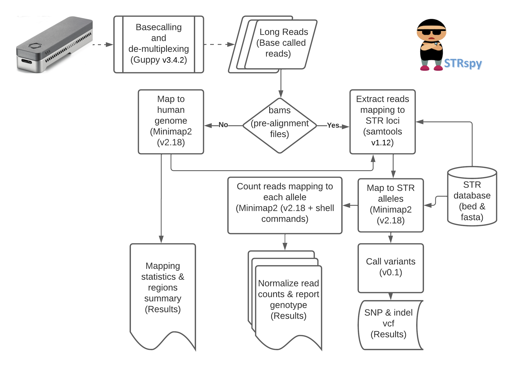

# strspy

# NEWS: We are pleased to announce our new release of STRspy i.e. 2.0 

( https://github.com/unique379r/strspy/tree/STRspy2.0 )

## Whats New in STRsp2.0
### 1. DB_v2: Autosome and ChrY-specific STRs (comprehensive STR database from GenBank records in the STRSeq BioProject (accessions: PRJNA380345 and PRJNA380347))
### 2. New Utility script to generate DB from Genebank and Fasta.
### 3. New Interface of command line options from main scripts
### 4. New Benchmarking results with multiple datasets including Case Samples

================================================================================================================================================================================================================

STRspy: a novel alignment and quantification-based state-of-the-art method, short tandem repeat (STR) detection calling tool designed specifically for long-read sequencing reads such as from Oxford nanopore technology (ONT) and PacBio.

## Cite

Hall CL, Kesharwani RK, Phillips NR, Planz JV, Sedlazeck FJ, Zascavage RR. Accurate profiling of forensic autosomal STRs using the Oxford Nanopore Technologies MinION device. Forensic Sci Int Genet. 2022 Jan;56:102629. doi: 10.1016/j.fsigen.2021.102629. Epub 2021 Nov 17. PMID: 34837788. https://pubmed.ncbi.nlm.nih.gov/34837788/

## Latest Publication 

Hall, C.L.; Kesharwani, R.K.; McBroom Henson, K.E.; Kapema, B.; Phillips, N.R.; Sedlazeck, F.J.; Zascavage, R.R. STRspy2.0: Unlocking the Potential of Long Reads for Forensic DNA Profiling. Int. J. Mol. Sci. 2026, 27, 1889. https://doi.org/10.3390/ijms27041889

## Overview

DNA evidence has long been considered the gold standard for human identification in forensic investigations. Most often, DNA typing exploits the high variability of short tandem repeat (STR) sequences to differentiate between individuals at the genetic level. Comparison of STR profiles can be used for human identification in a wide range of forensic cases including homicides, sexual assaults, missing persons, and mass disaster victims. The number of contiguous repeat units present at a given microsatellite locus varies significantly among individuals and thus makes them useful for human identification purposes. Here, we are presents a complete pipeline i.e. STRspy to identify STRs in a long read sample i.e. Oxford nanopore sequencing reads and Pacbio reads.

## Key Features

1. Input either fastq (raw reads usually from ONT) or bam (pre-aligned reads usually from PacBio)
2. Reports raw counts of allele along with their Normalized counts by their maximum value
3. Find the top two significant Alleles (filtering threshold set by the user such as 0.4)
4. Detects Small variants such as SNP and Indels
5. Reports mapping summary and STR region of overlaps
6. Stutters analysis for simple motifs of STRs

## Installation

1.1 Install Miniconda

Download Miniconda installer from here: https://docs.conda.io/en/latest/miniconda.html and Install it to your laptop or server.

### Conda under linux environment

`wget https://repo.anaconda.com/miniconda/Miniconda3-py39_4.9.2-Linux-x86_64.sh`

`bash Miniconda3-py39_4.9.2-Linux-x86_64.sh`

Follow the instructions directed by the miniconda script

1.2 Install STRspy 

STRspy includes the installation of the following third-party software before it can be used.

`gnu parallel >=20210222`

`samtools >=v1.12`

`bedtools >=v2.30.0`

`minimap2 >=v2.18-r1015`

`xatlas >=v0.2.1`

### Clone the repository

`git clone git@github.com:unique379r/strspy.git`

`cd strspy`

### Create an environment

`bash setup/STRspy_setup.sh`

### Activate the environment

`conda activate strspy_env`

### Set up configuration

`bash setup/MakeToolConfig.sh`

`mv UserToolsConfig.txt config/`

### deactivate the environment

`conda deactivate`

## Quickstart

Modify the config files describing your data `config/InputConfig.txt`

## Run STRspy

`cd strspy`

`bash ./STRspy_run_v1.0.sh -h`

`USAGE: bash ./STRspy_run_v1.0.sh config/InputConfig.txt config/ToolsConfig.txt`

## Running with test datasets

The testset is provided `testset.tar.gz` with the package for the quick start, however, pre-computed results `test_results.tar.gz` are also available for reproducibility purposes. The test data should finish less than 12 Sec (via simple terminal use) to generate the results.

### Extracting tar.gz Files

`tar -xvf demodata/testset.tar.gz`

### Note: don't forget to change the config files & run the commands as instructed above

Compare your test results with pre-computed outputs here

`tar -xvf demodata/test_results.tar.gz`

## InputConfig.txt

INPUT_DIR	: A dir must have either fastq (Oxford nanopore genomic reads) or bam (aligned genomic reads such as from PacBio)

INPUT_BAM	: Given inputs are bam or fastq (yes or no)

READ_TYPE	: Sequencing Technology (ont or pb)

STR_FASTA	: A dir contains Fasta files for each STR region of interest [assimung it has flanking regions (+/-) of 500bp]

STR_BED 	: A dir contains Bed files for each STR region of interest [assimung it has flanking regions (+/-) of 500bp]

GENOME_FASTA: Genome fasta (hg19/hg38) must provide in case of fastq input.

REGION_BED	: All STr\R bed has to concatenate into a single bed file to calculate the coverage of it from the alignment sample file.

NORM_CUTOFF	: A normalization threshold is required to select the top two allles of a STR

OUTPUT_DIR : A empty directory to write the results

## ToolsConfig.txt

BEDTOOLS 	=	../user/path/bedtools

MINIMAP 	=	../user/path/minimap2

SAMTOOLS 	=	../user/path/samtools

XATLAS 		=	../user/path/xatlas

PARALLEL 	=	../user/path/parallel

## Note

One may encounter a bug that using a wrapper (`STRspy_run_v1.0.sh`), STRspy parallel version may not be able to communicate properly with "gnu parallel" and exit the workflow without mapping or further steps of the analysis. The solution to this, the user may either run the script directly from scripts/STRspy_v1.0.sh in the STRspy dir or modify the STRspy_run_v1.0.sh script and allow the nested loop version of the workflow, but bear in mind that this is a little slower than the parallel version.

## Evaluation

STRspy has been evaluated on 2 datasets including 30 cycles and 15 cycles of the ONT reads. Please have a look plots below for the benchmarking of the datasets we used. For more details please refer to our paper `Hall CL, Kesharwani RK, Phillips NR, Planz JV, Sedlazeck FJ, Zascavage RR. Accurate profiling of forensic autosomal STRs using the Oxford Nanopore Technologies MinION device. Forensic Sci Int Genet. 2022 Jan;56:102629. doi: 10.1016/j.fsigen.2021.102629. Epub 2021 Nov 17. PMID: 34837788.`

## Heatmap of predicted STRs (30cycle and 15cycle)

## References
Aaron R. Quinlan, Ira M. Hall, BEDTools: a flexible suite of utilities for comparing genomic features, Bioinformatics, Volume 26, Issue 6, 15 March 2010, Pages 841–842, https://doi.org/10.1093/bioinformatics/btq033

Li, H. (2018). Minimap2: pairwise alignment for nucleotide sequences. Bioinformatics, 34:3094-3100. https://doi:10.1093/bioinformatics/bty191

Heng Li, Bob Handsaker, Alec Wysoker, Tim Fennell, Jue Ruan, Nils Homer, Gabor Marth, Goncalo Abecasis, Richard Durbin, 1000 Genome Project Data Processing Subgroup, The Sequence Alignment/Map format and SAMtools, Bioinformatics, Volume 25, Issue 16, 15 August 2009, Pages 2078–2079, https://doi.org/10.1093/bioinformatics/btp352

Jesse Farek, Daniel Hughes, Adam Mansfield, Olga Krasheninina et al (2018). xAtlas: Scalable small variant calling across heterogeneous next-generation sequencing experiments. bioRxiv; doi: https://doi.org/10.1101/295071

O. Tange (2018): GNU Parallel 2018, March 2018, https://doi.org/10.5281/zenodo.1146014.

## Contacts
bioinforupesh200 DOT au AT gmail DOT com

rupesh DOT kesharwani AT bcm DOT edu

